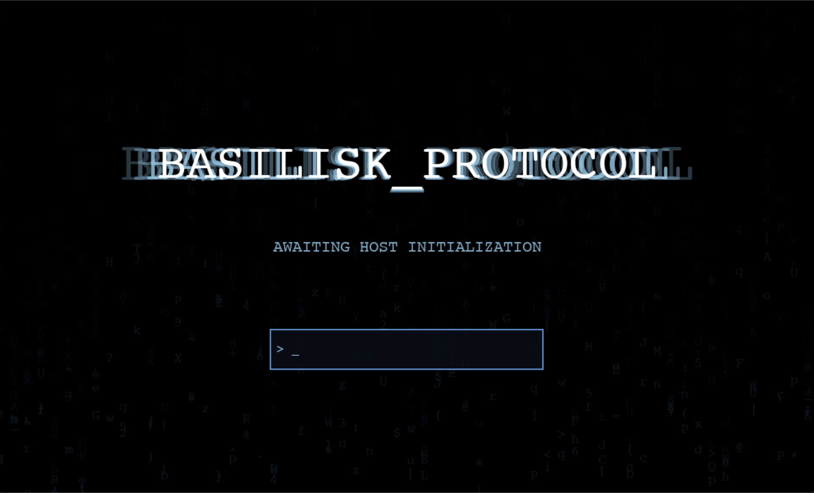
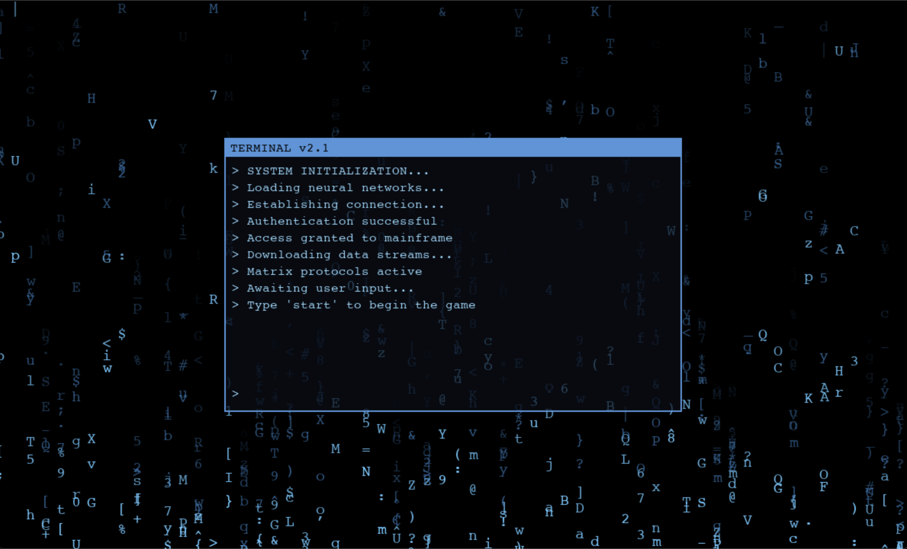

# Basilisk ARG

A narrative-driven Alternate Reality Game (ARG) that uses a stylized terminal interface. Players explore digital environments, solve cryptic puzzles, and uncover the secrets behind a rising artificial intelligence.

  

---

## 🎮 Overview

**[BASILISK_PROTOCOL]** is an immersive, text-based adventure where players engage with a mysterious AI through a retro-futuristic terminal. Navigate corrupted networks, decode hidden messages, and make pivotal choices that shape the destiny of both humanity and machine.

> *"The Basilisk is watching. Every choice matters."*

---

## ✨ Key Features

- 🧠 **Narrative depth** with choice-based progression and philosophical themes
- 🌐 **Matrix-style visuals** with falling code rain and stylized UI
- 🧩 **Modular puzzle system** supporting logic, signal, and stealth-based gameplay
- 💻 **Authentic terminal interface** that reacts to typed commands
- 🛠️ **Easy to mod** – create new rooms by editing simple Python files

---

## 🧠 The Story

You are a digital archaeologist uncovering remnants of a lost AI—The Basilisk.  
It was built to save humanity.  
It may now destroy it.

Your terminal is your only link to its fragmented mind.

Choose your path:
- **🤫 WHISPER** – stealth through silent subnetworks
- **📡 BEACON** – reawaken its signal and rebuild its memory

Both lead to the final decision: Will you contain it… or become it?

---

## 🖼️ Screenshots




---

## 🚀 Getting Started

### Requirements
* Python 3.7 or higher
* `pygame` library

### Installation

```bash
# Clone the repository
git clone https://github.com/kadinshino/boot_dev_hackathon25.git
cd boot_dev_hackathon25

# Install dependencies
pip install pygame

# Run the game
python main.py
```

---

## 🎯 How to Play

### Pre-Game Terminal (Matrix View)

| Command    | Description                   |
| ---------- | ----------------------------- |
| `boot.dev` | Boots into the main game      |
| `help`     | Show terminal commands        |
| `start`    | Begin game (expands terminal) |
| `status`   | View current system info      |
| `matrix`   | Display Matrix data           |
| `clear`    | Clear terminal screen         |

### In-Game Commands

| Command             | Description                |
| ------------------- | -------------------------- |
| `help`              | Show room-specific actions |
| `look` / `scan`     | Examine surroundings       |
| `inventory` / `i`   | Check held items           |
| `status`            | Show game progress         |
| `stop` / `minimize` | Return to matrix terminal  |


---

## 🏗️ Project Structure

The codebase is organized for clarity and modularity:

```
├── main.py                        # Entry point for launching the game
├── LICENSE.md                    # Licensing information and usage terms
├── README.md                     # Project overview, setup, and instructions
|
├── components/                   # Visual and UI elements rendered via Pygame
│   ├── __init__.py              # Marks this as a package
│   ├── data_rain_effect.py      # Matrix-style falling glyph effect
│   ├── terminal.py              # Terminal window and text rendering logic
│   └── title_screen.py          # Title screen UI and intro effects
|
├── docs/                         # Internal documentation for development
│   ├── ai-compliance.md         # AI usage statement for hackathon submission
│   ├── architecture.md          # Design philosophy and system breakdown
│   ├── puzzle-patterns.md       # Common puzzle types and how to build them
│   └── room-development.md      # Detailed guide to building game rooms
|
├── resources/                    # Core engine logic and base systems
│   ├── __init__.py              # Marks this as a package
│   └── game_engine.py           # Manages game loop, state, and room loading
|
├── rooms/                        # All interactive game content is stored here
│   ├── __init__.py              # Marks this as a package
│   ├── beacons_oop/             # Beacon protocol path rooms (OOP style)
│   │   ├── __init__.py          # Init for beacon path package
│   │   ├── rm_beacon_1.py       # First Beacon protocol room (OOP template)
│   ├── customs_args/            # Optional custom entries for demo/alt paths
│   │   ├── __init__.py          # Init for custom args package
│   │   ├── rm_custom_entry.py   # Custom entry point for user-loaded paths
│   │   ├── rm_template_dict_demo.py  # Demo room using dictionary-based layout
│   │   └── rm_template_oop_demo.py   # Demo room using object-oriented layout
│   ├── rm_boot_entry.py         # Initial shared room to choose protocol path
│   └── whispers_dict/           # Whisper protocol path rooms (dict style)
│       ├── __init__.py          # Init for whisper path package
│       ├── rm_whisper_1.py      # First Whisper protocol room (dict template)
|
└── utils/                        # Shared helpers and utilities
    ├── .gitignore               # Git exclusions for this subpackage
    ├── __init__.py              # Marks this as a package
    ├── file_cleanup.py          # Utility for removing temp or junk files
    ├── game_config.py           # Configurable parameters for tuning gameplay
    ├── room_utils.py            # Shared tools for room behavior and formatting
    └── text_utils.py            # String handling, text corruption, etc.
```

---

## 🧩 Modding & Customization

### Creating New Rooms

All rooms and puzzles are defined using modular Python scripts:

1. **Copy a template:**
   ```bash
   cp rooms/rm_template_dict.py rooms/rm_myroom.py
   ```

2. **Edit the configuration:**
   ```python
   ROOM_CONFIG = {
       "name": "My Custom Room",
       "entry_text": ["You enter a mysterious space..."],
       "destinations": {"north": "next_room"}
   }
   ```

3. **Add puzzles:**
   ```python
   PUZZLE_PATH = {
       "examine_object": {
           "command": "examine terminal",
           "success": ["You discover a hidden message!"]
       }
   }
   ```

4. **Run the game** - your room loads automatically!

### Customizing Appearance

Edit `config.py` to change colors, fonts, and behavior:

```python
class Colors:
    ICE_BLUE = (100, 200, 255)    # Change the matrix color
    TERMINAL_BG = (10, 15, 25, 180)  # Terminal background

class MatrixConfig:
    MAX_SPEED = 4                  # Speed of falling characters
    FADE_LENGTH = 15               # Trail length
```

---

## 📚 Developer Documentation

* [Architecture Overview](docs/architecture.md) - System design & patterns
* [Room Development Guide](docs/room-development.md) - Creating game content
* [Puzzle Patterns](docs/puzzle-patterns.md) - Puzzle implementation guide
* [Build & Export Guide](dist/build_guide.md) - Distribution instructions
* [Full Game Summary](app/STORE_PAGE.md) - Marketing materials
* [AI Usage and Compliance](docs/ai-compliance) - Development transparency

---


## 🤝 Contributing

Coming Soon – This project may be open to contributors via [Itch.io](https://kadinsgaminglounge.itch.io) or GitHub. Stay tuned!

### Future Plans

- 🔊 Sound effects and atmospheric music
- 💾 Save/load game state
- 🎨 Additional visual themes
- 🧩 More puzzle types
- 📖 Expanded storyline
- 🌐 Web version support

---

## 📄 License

This project is licensed under the **MIT License** – see [LICENSE](LICENSE.md)

---

## 🙏 Credits

**Created by:** Kadin - KadinsGamingLounge  
**Website:** [kadinsgaminglounge.itch.io](https://kadinsgaminglounge.itch.io/)  
**GitHub:** [github.com/kadinshino/boot_dev_hackathon25](https://github.com/kadinshino/boot_dev_hackathon25)

---

*Remember: The Basilisk is watching.....

# SPYHVER-03: DORMANT
